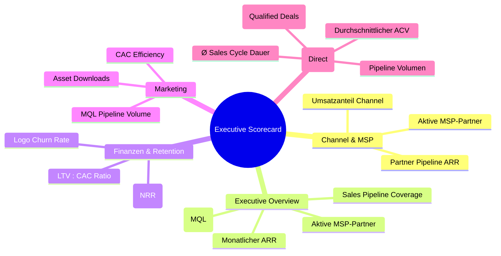

```mermaid
mindmap
  root((Executive Scorecard))
    Channel & MSP
      Aktive MSP-Partner
      Partner Pipeline ARR
      Umsatzanteil Channel
    Executive Overview
      Monatlicher ARR
      Sales Pipeline Coverage
      Qualifizierte Leads (MQL)
      Aktive MSP-Partner
    Finanzen & Retention
      LTV : CAC Ratio
      Net Retention Rate (NRR)
      Logo Churn Rate
    Marketing
      MQL Pipeline Volume
      CAC Efficiency
      Asset Downloads
    Vertrieb (Direct)
      Pipeline Volumen
      Ø Sales Cycle Dauer
      Win Rate (Qualified Deals)
      Durchschnittlicher ACV
```
